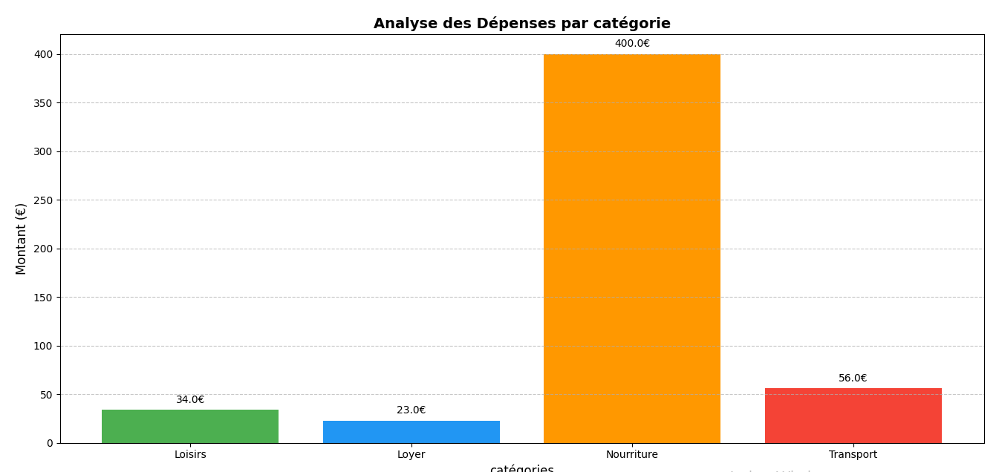
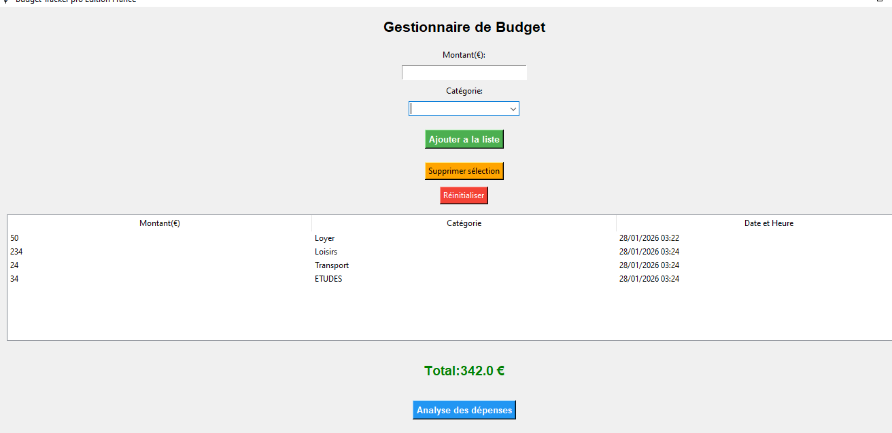
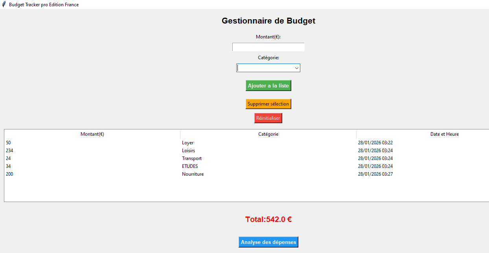

Mon Projet : Gestionnaire de Budget Personnel 📊

Bonjour ! Voici mon application de gestion de budget que j'ai créée avec *Python*. J'ai conçu cet outil pour aider à suivre les dépenses quotidiennes de manière simple et visuelle.

## 🌟 Ce que fait l'application :
* *Enregistrement des dépenses* : On peut ajouter un montant et choisir une catégorie (Loyer, Courses, etc.).
* *Système d'alerte* : La fenêtre devient *verte* si tout va bien, et *rouge* si on dépasse le budget ! 
* *Graphique automatique* : J'ai utilisé Matplotlib pour créer un petit graphique qui montre où part l'argent.

## 📸 Quelques captures d'écran :

### Mon Graphique d'analyse

### L'interface du programme
| Si le budget est OK | Si le budget est dépasse |
| :---: | :---: |
|  |  |

## 🛠️ Outils utilisés :
J'ai utilisé *Tkinter* pour l'interface, *SQLite3* pour garder les données en mémoire, et *Matplotlib* pour les dessins.
